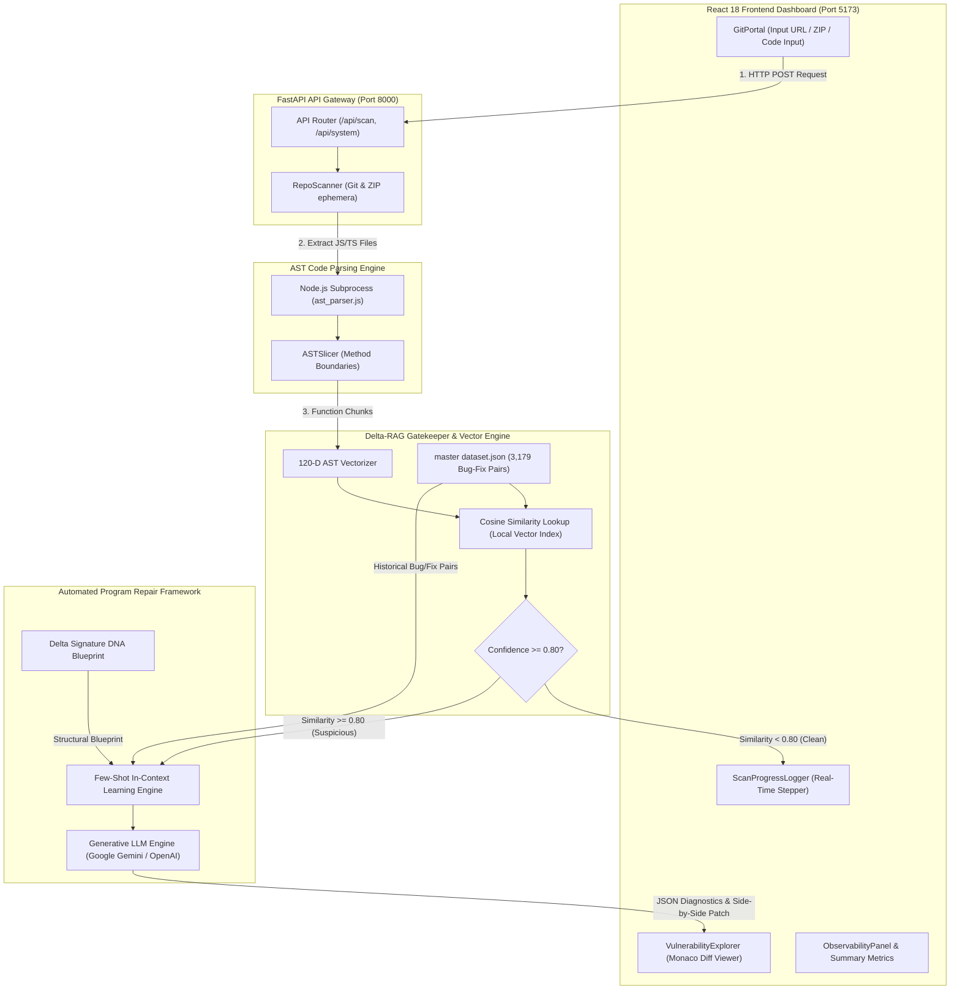
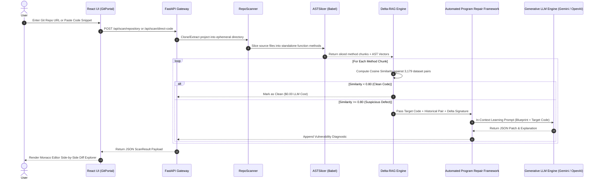

# BugIdentifier System Architecture & Flow Diagrams

Industrial-grade Code-RAG Bug Detection and Automated Program Repair (APR) platform using AST parsing, Comparison-Based Error Mining (Delta-RAG), and Few-Shot In-Context LLM Synthesis.

---

## 1. High-Level System Architecture Diagram



---

## 2. Sequence Diagram (User Request to LLM Patch)



---

## 3. Database Schema Blueprint (`dataset.json` & MongoDB)

### Historical Bug-Fix Commit Record (`HistoricalBugFix`)
```json
{
  "_id": "delta_01549",
  "commit_id": "c0c3107334",
  "commit_message": "fix(i18n): localize resources navigation label",
  "project_name": "MartinDelophy/ai-video-editor",
  "file_path": "src/i18n.js",
  "buggy_code_chunk": "const COMMUNITY_LINKS_COPY = { ... }",
  "fixed_code_chunk": "import { I18N_COMPLETION_COPY } from './i18nCompletion.js'; ...",
  "bug_type": "null_pointer",
  "severity": "Medium",
  "explanation": "Missing optional chaining boundary check for undefined navigation label.",
  "ast_vector_120d": [0.0, 0.0, 2.0, 0.0, 1.0, 0.0, 0.12, 0.85, ...],
  "delta_signature": {
    "added_boundary_check": 1,
    "added_await": 0,
    "delta_op_gt": 0,
    "complexity_delta": 2
  },
  "metadata": {
    "language": "JavaScript",
    "framework": "React"
  }
}
```

---

## 4. Architectural Summary Metrics

| Component | Technology | Role / Specification |
| :--- | :--- | :--- |
| **Frontend Dashboard** | React 18 + Vite + Tailwind CSS v4 | Interactive Git portal, Monaco Editor side-by-side diff, live telemetry. |
| **API Gateway** | FastAPI (Python 3.13) + Uvicorn | Async REST routing, CORS middleware, scan background tasks. |
| **Parsing Engine** | Babel Parser (`@babel/parser`) | Node.js subprocess parsing JS/TS code into syntactic method boundaries. |
| **Vector Index** | NumPy + Scikit-Learn TF-IDF | 120-D AST vector matrix & TF-IDF similarity search over 3,179 master pairs. |
| **APR & LLM Engine** | Automated Program Repair Framework & Google Gemini / OpenAI | Few-Shot In-Context Learning guided by structural Delta Signatures. |
